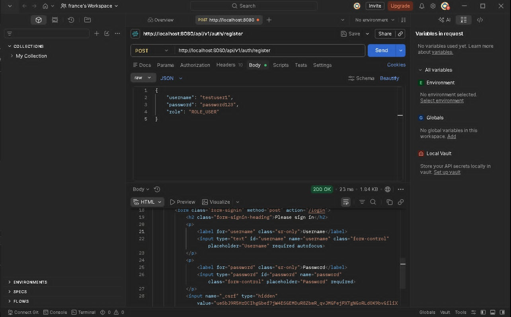
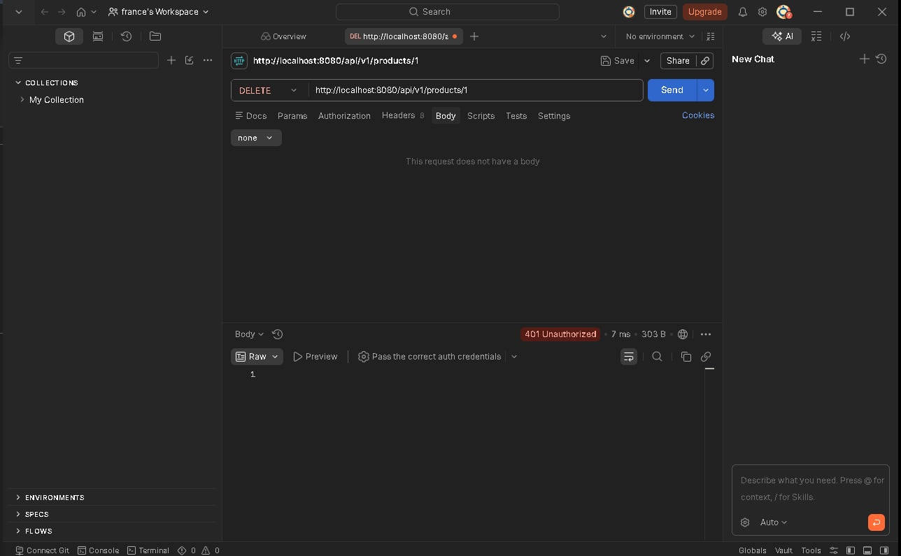
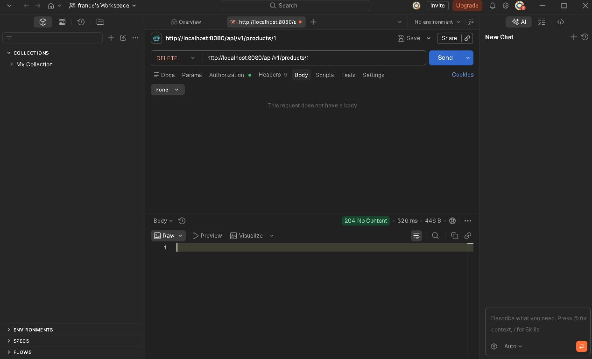
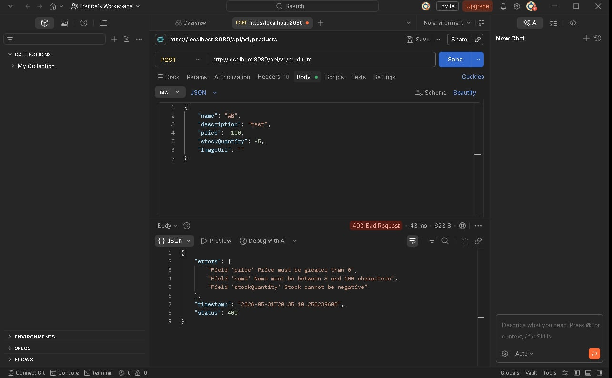

# EcommerceApi

A Spring Boot REST API for an e-commerce platform with full database integration,
Spring Security session-based authentication, and Bean Validation.

---

## Authors
- John Patrick Ofilanda
- Francis Anthony Aludo

---

## Security Architecture

### How Session-Based Authentication Works

1. User submits username and password to `POST /login`
2. Spring Security verifies credentials against the database
3. On success, server creates a **session** and sends a `JSESSIONID` cookie to the browser
4. Browser automatically sends the `JSESSIONID` cookie with every subsequent request
5. Server validates the cookie to identify the user
6. On logout (`POST /logout`), the session is invalidated and cookie is deleted

### Why Session-Based (not JWT)?
- Sessions are stored **server-side** — more secure for web apps
- No need to manually handle tokens on the frontend
- Browser handles cookies automatically

---

## Validation Rules

### CreateProductDto
| Field | Constraint | Message |
|-------|-----------|---------|
| `name` | `@NotBlank`, `@Size(min=3, max=100)` | Name is required, min 3 characters |
| `description` | `@NotBlank` | Description is required |
| `price` | `@NotNull`, `@Positive` | Price is required, must be greater than 0 |
| `stockQuantity` | `@NotNull`, `@Min(0)` | Stock is required, cannot be negative |

### RegisterUserDto
| Field | Constraint | Message |
|-------|-----------|---------|
| `username` | `@NotBlank`, `@Size(min=8, max=20)` | Username must be 8-20 characters |
| `password` | `@NotBlank`, `@Size(min=6)` | Password must be at least 6 characters |
| `role` | `@NotBlank` | Role is required |

---

## API Reference

### Public Endpoints (No Authentication Required)
| Method | Endpoint | Description |
|--------|----------|-------------|
| GET | `/api/v1/products` | Get all products |
| GET | `/api/v1/products/{id}` | Get product by ID |
| GET | `/api/v1/products/filter` | Filter products |
| POST | `/api/v1/auth/register` | Register a new user |
| POST | `/login` | Login (returns JSESSIONID cookie) |
| POST | `/logout` | Logout (invalidates session) |

### Protected Endpoints (Authentication Required)
| Method | Endpoint | Role Required | Description |
|--------|----------|--------------|-------------|
| POST | `/api/v1/products` | ADMIN | Create a product |
| PUT | `/api/v1/products/{id}` | ADMIN | Update a product |
| PATCH | `/api/v1/products/{id}` | ADMIN | Partially update a product |
| DELETE | `/api/v1/products/{id}` | ADMIN | Delete a product |
| GET | `/api/v1/auth/me` | Any logged in user | Get current user info |
| POST | `/api/v1/orders` | Any logged in user | Create an order |

### Authentication Error Responses
| Status | Meaning | Action |
|--------|---------|--------|
| `401` | Not logged in | Redirect to login page |
| `403` | Wrong role | Show Access Denied message |

---

## HTTP Status Codes
| Code | Meaning |
|------|---------|
| 200 | OK - request successful |
| 201 | Created - resource created |
| 204 | No Content - resource deleted |
| 400 | Bad Request - invalid input |
| 401 | Unauthorized - not logged in |
| 403 | Forbidden - wrong role |
| 404 | Not Found - resource not found |
| 500 | Internal Server Error |

---

## Validation Error Response Format

When validation fails the API returns:
```json
{
    "timestamp": "2026-05-31T15:00:00",
    "status": 400,
    "errors": [
        "Field 'name' must be between 3 and 100 characters",
        "Field 'price' must be greater than 0"
    ]
}
```

---

## Database Schema

### Tables and Relationships
| Table | Description |
|-------|-------------|
| `categories` | Stores product categories |
| `products` | Stores products, linked to categories via `category_id` |
| `orders` | Stores customer orders |
| `order_items` | Links orders to products |
| `users` | Stores registered users with hashed passwords |

### Relationships
- **Category → Product**: One-to-Many
- **Order → OrderItem**: One-to-Many
- **OrderItem → Product**: Many-to-One

---

## How to Run

1. Make sure MySQL is running and `ecommerce_db` exists
2. Update `src/main/resources/application.properties` with your MySQL password
3. Set JAVA_HOME:
```bash
$env:JAVA_HOME = "C:\Users\Administrator\.jdks\corretto-21.0.11"
```
4. Build the project:
```bash
.\gradlew.bat build -x test
```
5. Run the app:
```bash
& "C:\Users\Administrator\.jdks\corretto-21.0.11\bin\java.exe" -jar build\libs\EcommerceApi-0.0.1-SNAPSHOT.jar
```
6. Open `products.html` with Live Server

---

## API Testing Proof

### POST
.png)

### GET ALL
.png)

### PATCH
.png)

### DELETE
.png)

---

## Tech Stack
- Java 21
- Spring Boot 3.3.5
- Spring Security (Session-Based Auth)
- Spring Data JPA
- Bean Validation
- MySQL 8.0
- Lombok


---

## Image Demo

### 1. User Registration


### 2. User Login (JSESSIONID cookie set)


### 3. Protected Action FAILING without session (401)


### 4. Protected Action SUCCEEDING with session


### 5. Validation Error (negative price)
